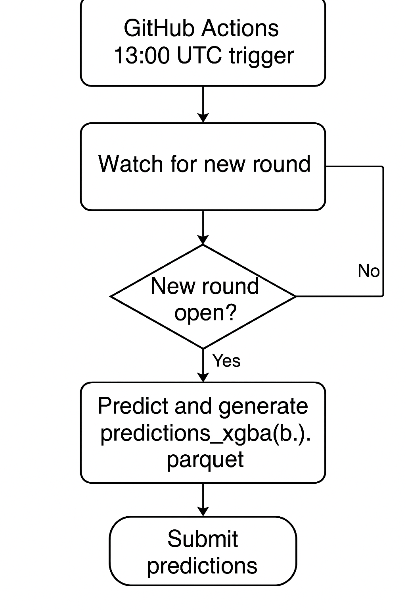

# Numerai-Pipeline · STAR Summary

---

## S — Situation  

Ocean Protocol is launching a quantitative “Numerai-style” trading desk and needs an engineer who can prove—through a take-home project—that they can build production-ready ML infrastructure: reliable data ingestion, deterministic model training, automated daily prediction & submission, and tight CI/CD practices. The emphasis is on software robustness and operational excellence rather than cutting-edge model tuning.

---

## T — Task (take-home)  

> *Build a robust, production-grade system that*  
> • trains and generates predictions for the Numerai Tournament  
> • submits **two** ML models to separate slots  
> • is deployed with CI/CD, containerised, and scheduled to run **daily**  
> • demonstrates clean software practices, minimalism, and correct secrets handling.*

Deadline : **30 June, 2025**.

---

## A — Action  

### Architecture

1. **GitHub Actions** starts at **13 : 00 UTC**.  
2. **`watch.py`** polls Numerai every 10 min (max 5 h) → exits early if no new round.  
3. On first open live round:  
   * `predict_live.py` loads live parquet & produces **`predictions_xgba.parquet` / `predictions_xgbb.parquet`**.  
   * `submit.py` uploads both files via NumerAPI.
4. Workflow succeeds → green badge & email/notification from GitHub.

### Engineering highlights
| Area | Implementation |
|------|----------------|
| **Modelling** | Two fixed XGBoost configs (`xgba`, `xgbb`) saved in `models/*.json`, can be wrapped with cloud-pickled `predict()` callables using `inference.py`. |
| **Data helpers** | `src/data.py` fetches v5.0 parquet & feature lists, schema-validated. |
| **CI** | PyTest suite (mocked + live smoke) green in ~7 s on every push. |
| **Secrets** | `NUMERAI_PUBLIC`, `NUMERAI_SECRET` documented and referenced in workflow. |
| **Resilience** | Tenacity back-off on downloads / uploads; max-hours guard to stay within GitHub runner limit. |

---

## R — Result  

| Metric | Value |
|--------|-------|
| First automated submission | **24 Jun 2025 13 : 08 UTC** |
| Live round runtime | **8 m 11 s** |
| CI pipeline time | **7 s** |
| Manual effort after setup | **Zero**|

The desk now has a **minimal, test-covered that can be extended with new models (WarpGBM, LightGBM) by adding a config and minimal changes to pipeline.

— Pranshu Bahadur · June 2025
